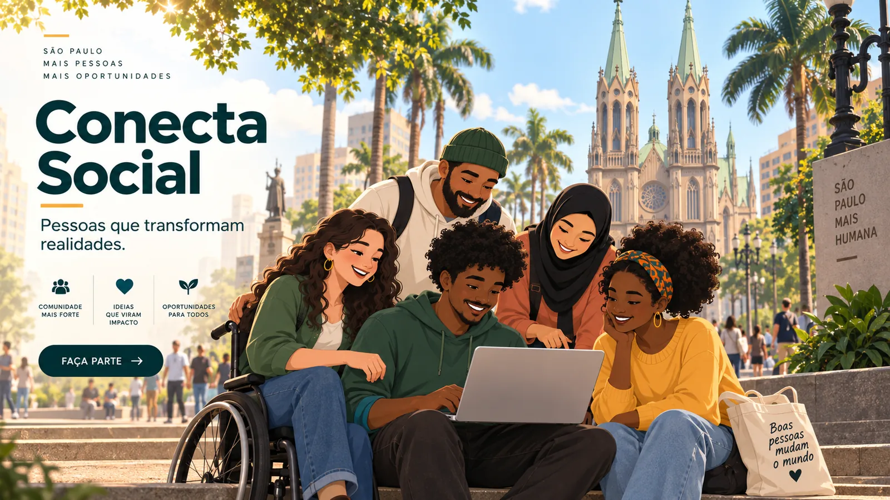
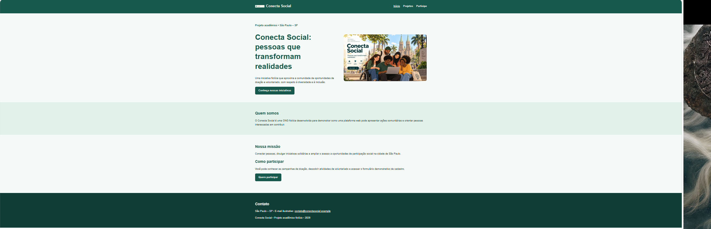
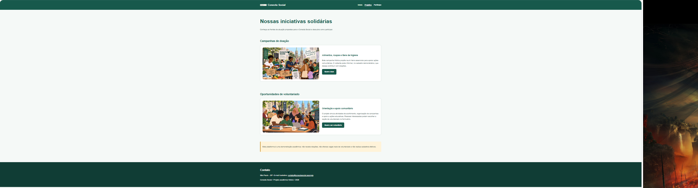
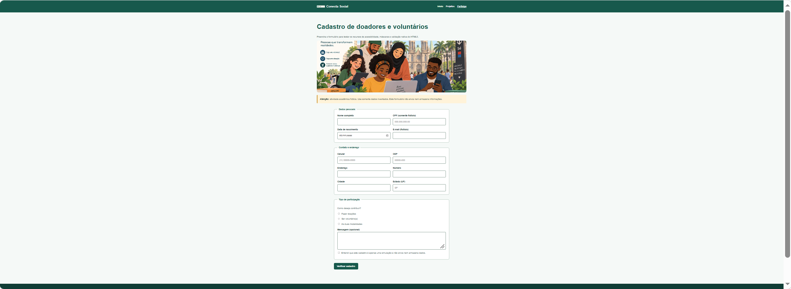

# 🌱 Conecta Social

### Pessoas que transformam realidades.




**Projeto acadêmico | Desenvolvimento Front-End para Web**

🌐 [Acessar o Conecta Social](https://iagovitobatista.github.io/conecta-social/)

---

## 📌 Sobre o projeto

O Conecta Social é um projeto acadêmico desenvolvido durante a disciplina de Desenvolvimento Front-End para Web, do curso de Análise e Desenvolvimento de Sistemas.

A proposta da atividade foi criar uma plataforma web fictícia para uma organização do terceiro setor, apresentando suas iniciativas sociais e permitindo o cadastro de pessoas interessadas em contribuir por meio de doações ou trabalho voluntário.

Aproveitei a atividade para praticar meus conhecimentos em desenvolvimento web, organização de arquivos, acessibilidade e formulários HTML5.

Também decidi publicar o projeto no GitHub para registrar meu aprendizado e começar a reunir meus trabalhos acadêmicos em um portfólio.

---

## 🎯 Objetivo

Desenvolver uma plataforma web simples e acessível para apresentar uma ONG fictícia e facilitar a navegação de pessoas interessadas em suas iniciativas sociais.

O projeto foi pensado para representar ações de solidariedade e voluntariado na cidade de São Paulo, utilizando imagens ilustrativas inspiradas na região da Praça da Sé.

---

## 💻 Tecnologias utilizadas

- **HTML5:** estruturação das páginas e utilização de elementos semânticos.
- **CSS3:** organização visual, cores e adaptação do layout para diferentes telas.
- **JavaScript:** aplicação de máscaras de entrada para CPF, telefone e CEP.
- **GitHub:** organização e versionamento dos arquivos.
- **GitHub Pages:** publicação gratuita do site.

---

## 🖥️ Visualização do projeto

### Página inicial

Apresenta a identidade do Conecta Social, sua missão e as principais informações sobre a organização fictícia.



### Projetos sociais

Apresenta iniciativas de doação e voluntariado, oferecendo informações sobre as formas de participação.



### Cadastro de voluntários e doadores

Contém um formulário demonstrativo com agrupamento dos campos, validações nativas do HTML5 e máscaras para CPF, telefone e CEP.



---

## ⚙️ Funcionalidades

- Navegação entre as três páginas do projeto.
- Apresentação institucional da ONG fictícia.
- Divulgação de iniciativas de doação e voluntariado.
- Formulário de cadastro demonstrativo.
- Campos obrigatórios e validações nativas do HTML5.
- Máscaras de entrada para CPF, telefone e CEP.
- Estrutura semântica e identificação dos campos para favorecer a acessibilidade.

---

## 📁 Estrutura do projeto

```text
conecta-social/
│
├── index.html
├── projetos.html
├── cadastro.html
├── README.md
│
├── css/
│   └── style.css
│
├── js/
│   └── mascaras.js
│
└── imagens/
    ├── banner-inicial-se.webp
    ├── projeto-doacoes-se.webp
    ├── projeto-voluntariado-se.webp
    ├── cadastro-voluntarios-se.webp
    ├── logo-conecta-social.svg
    ├── icone-conecta-social.svg
    ├── print-inicio.png
    ├── print-projetos.png
    └── print-cadastro.png
```

A pasta de imagens também contém versões adicionais dos recursos visuais em outros formatos.

---

## 📚 Aprendizados

Durante o desenvolvimento deste projeto, pude praticar:

- A utilização de tags semânticas do HTML5.
- A organização lógica das informações em páginas web.
- A aplicação de atributos de acessibilidade em imagens e formulários.
- A criação de formulários com validações nativas.
- A organização dos arquivos em diretórios.
- A publicação de um projeto utilizando GitHub Pages.

O desenvolvimento também foi uma oportunidade para aprender mais sobre a criação de páginas web e compreender a importância de planejar a estrutura antes de trabalhar na apresentação visual.

---

## ℹ️ Observação

O Conecta Social é um projeto fictício, desenvolvido exclusivamente para fins acadêmicos e de aprendizagem.

A plataforma não representa uma ONG real, não recebe doações e não realiza cadastros efetivos. O formulário é apenas uma demonstração de recursos de desenvolvimento Front-End.

---

## 👨‍💻 Autor

**Iago Vito Batista**

Estudante de Análise e Desenvolvimento de Sistemas.

Projeto desenvolvido como parte das atividades acadêmicas e publicado para compartilhar meu processo de aprendizagem em tecnologia.

🌐 [Visualizar o projeto](https://iagovitobatista.github.io/conecta-social/)
